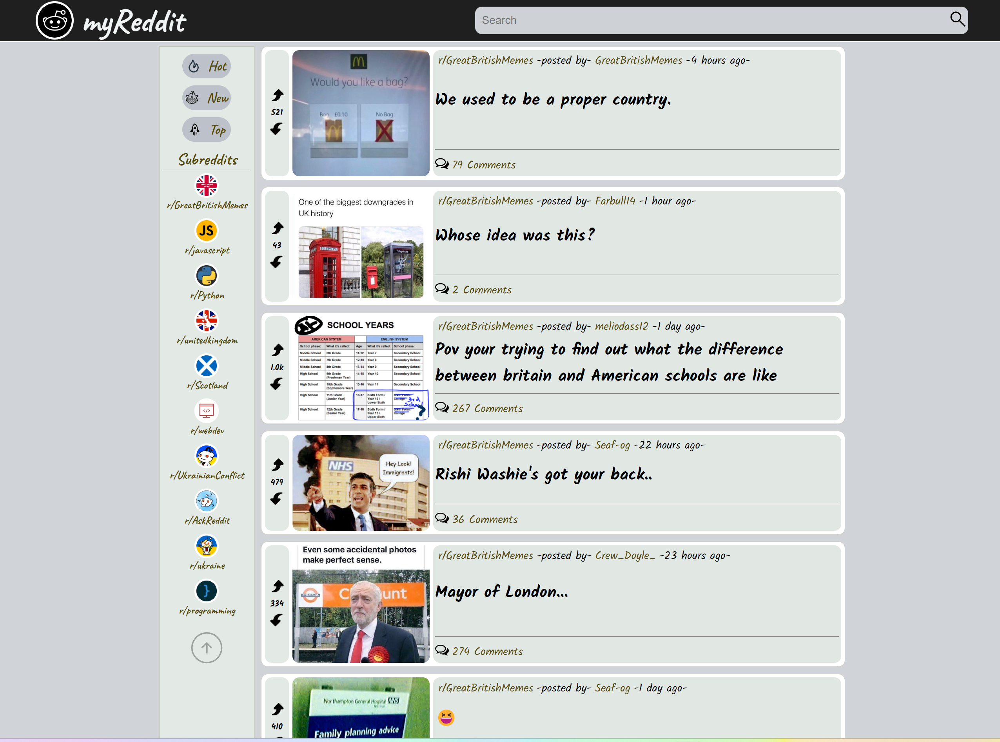

# [_myReddit_](https://lucent-piroshki-874535.netlify.app/)
It's a pocket version of the American social network news, content ratings and discussion website - [Reddit](https://www.reddit.com/)

## Review

[_myReddit_](https://lucent-piroshki-874535.netlify.app/) helps you view specific content that registered users have submitted to [Reddit](https://www.reddit.com/).

[_myReddit_](https://lucent-piroshki-874535.netlify.app/) is an adaptive application that makes it possible to use it comfortably on mobile devices, as well as on large monitors and tablets

My Reddit allows:
- *view links, text messages, images and videos (although without sound due to API limitations)*
- *viewing the number of votes received by each publication*
- *view comments for each publication*
- *use the site's search engine to find the content you need*
- *follow the link to the original* [Reddit](https://www.reddit.com/)
- *sort the posts according to your preferences by 10 subreddits*
- *sort the posts according to your preferences by  the popularity of the post or the time of publication, as well as 
  view the posts that are gaining popularity*
- *see who published the post and when*

## Technologies

 - React : *Interface library*
 - Redux : *Global state management*
 - Jest & React Testing Library (RTL): *Testing suite*

The main codebase consists of Javascript.

## Installation

Clone or download the repo.
Open the directory and run npm to install.
Run development application by using npm start.

## Using

The *"public"* folder contains an *"img"* folder with all the icons.

The *"test"* folder contains tests for the main components.

The *"features"* folder contains the main components and slices: HeaderBar, Subreddits, Posts and Comments.

The *"header"* folder contains components and slice that are responsible for displaying the top part of the site:
- logo
- and input for data search

The *"subcredits"* folder contains the slideshow components that display the navigation bar on the left, which consists of 
three parts:
- buttons for sorting posts
- list of subreddits
- a button to go to the top of the window

The *"post"* folder contains components and a slice for displaying the main content of the post and media.

The *"comment"* folder contains a component and a Slice for displaying a specific post and comments.

## Acknowledgments

This project utilizes the Reddit JSON API to retrieve data from Reddit.

*The project was a task assigned by Codecademy as part of their full-stack engineer course path. The objective of 
the project was to demonstrate all the skills and technologies learned up to this point on the path, including 
HTML/CSS, JavaScript, React, Redux, Jest and RTL, Git and GitHub Projects, and command-line proficiency*.

## Developers
[_myReddit_](https://lucent-piroshki-874535.netlify.app/)  created by *Yurii Petrovsky*
> This project was bootstrapped with [Create React App](https://github.com/facebook/create-react-app).
